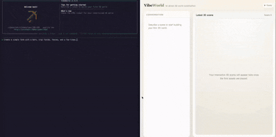
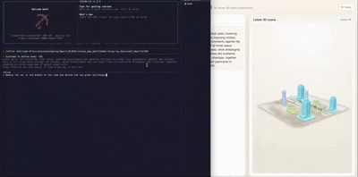
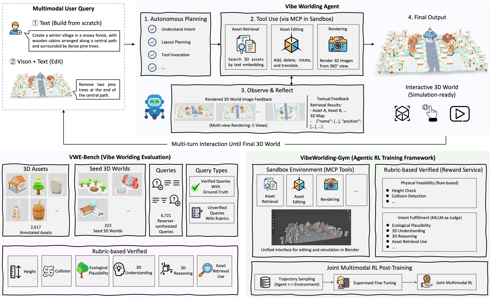
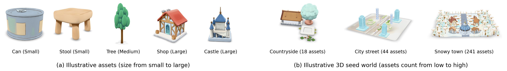
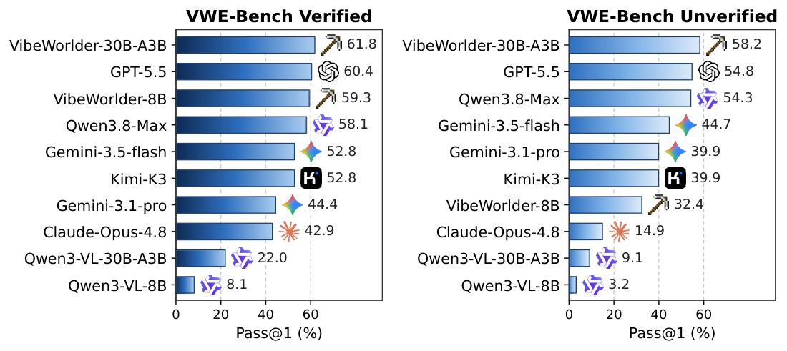
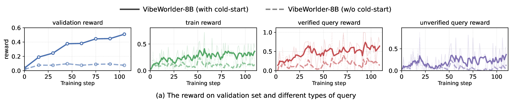
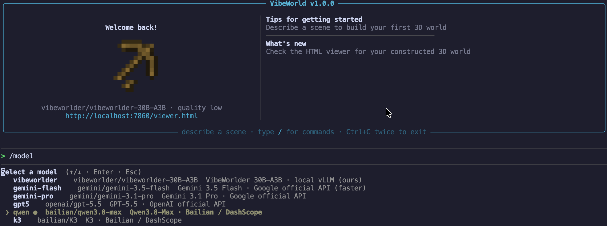

# VibeWorlding: Can Multimodal Agents Construct 3D Open Worlds End-to-End?

<p align="center">
   <a href="https://huggingface.co/datasets/usail-hkust/VWE-Bench">VWE-Bench Dataset</a> &nbsp;|&nbsp;
   <a href="https://huggingface.co/collections/usail-hkust/vibeworlder">VibeWorlder Models</a>&nbsp;|&nbsp;
   <a href="https://huggingface.co/collections/usail-hkust/vibeworlder">VibeWorlding Paper</a>
</p>

VibeWorlding is a unified open-source framework for **benchmarking and
training vibe worlding agents**: the multimodal agents that autonomously infer user
intent, plan a scene layout, invoke 3D tools, and
reflect on multimodal feedback (the 3D map plus rendered images) over multi-turn
agent–environment interaction.

## Watch it build a world

The vibeworlding agent handles two task families end-to-end: **3D world construction** (build
a 3D world from scratch) and **3D world refinement** (refine an existing
3D world). The illustrative examples are here:

**3D World Construction** — build a 3D world from scratch:

Example query: Create a simple farm with a barn, crop fields, fences, and a few trees.

<p align="center">
  
</p>

**3D World Refinement** — refine an existing 3D world:

Example query: Remove the car in the middle of the road and delete the two green buildings.

<p align="center">
  
</p>

---

## 1. Introduction



The framework has two halves that share the same Blender sandbox. **VWE-Bench**
(left) is the evaluation suite — 2,616 curated 3D assets, 323 human-annotated
seed worlds, and 6,828 reverse-synthesized queries spanning world *construction*
and *refinement* — scored by a rubric-based verifier. **VibeWorlding-Gym** (right)
is the training framework: the same sandbox is exposed to the agent as MCP-style
tools, and the same verifier is used as the reward service for joint multimodal
RL post-training.

**How the agent works.** Each turn the agent observes the current 3D map plus 5
rendered views, then calls tools — `retrieve_assets`, `add`, `delete`,
`rotation_and_translation`. The scene is re-rendered and fed back, so the agent
can *see* what it built and fix it.

The role of every box in the figure maps to a concrete component in this repo:

| Component | What it is |
|---|---|
| **Sandbox environment** | Asset retrieval + PCG editing + Blender rendering, exposed to the agent as tools |
| **Rubric-based verifier** | Physical feasibility (collision, floating, bounds) + intent fulfillment; usable both as an evaluator and as an RL reward service |
| **VWE-Bench data** | 2,616 3D assets, 323 human-annotated seed 3D worlds, 6,828 reverse-synthesized multimodal queries |
| **Training recipes** | SFT and multimodal RL (GRPO) on top of `verl` |
| **Baselines** | SceneWeaver / SAGE / SceneAssistant reproduced in the same sandbox |
| **CLI** | An interactive terminal agent for building worlds live |

### Repository outline

```
VibeWorlding-Gym/
├── main.py                  # agent sampling (generate / refine)
├── eval.py                  # evaluation entry point (3 verifier routes)
├── render_raw_data_images.py# batch-render 5 views for a data directory
├── start_verl_server.py     # serve a local model with vLLM (eval/sampling)
├── start_verl_server_CLI.py # serve a local model with vLLM (for the CLI)
├── assets_retrieval/        # ▸ asset retrieval service   (see its README)
│                            #   models/ ships VibeWorlder-Embedding-4B
├── render_in_blender/       # ▸ PCG rendering service     (see its README)
│                            #   assets/models/clone/ ships the GLB assets
├── utils/                   # LLM clients, agent tools, prompts,
│                            #   map_parser.py (3D map → PCG actors),
│                            #   broker.py (concurrent verifier RPC), scene utils
├── verifier/                # rubric + rule-based verifiers
├── baseline/                # SceneWeaver / SAGE / SceneAssistant
├── CLI_Demo/                # VibeWorld interactive CLI   (see its README)
├── verl/                    # SFT + RL training
├── data/
│   ├── sft_data_process.py  # sampled log -> packed SFT parquet
│   ├── sft/                 # 5,567 SFT cases (1,129 construction + 4,438 refinement)
│   ├── test/                # 254 evaluation cases
│   ├── rl/                  # RL parquet (train/test)
│   └── seed_3dworld/        # seed 3D worlds (fill from VWE-Bench)
└── log/                     # sampling / eval outputs
```

---

## 2. VWE-Bench Statistics

VWE-Bench is what the agent is benchmarked and trained on. It is built from
three ingredients, all shipped in this repo.

**Assets & seed worlds.** A curated library of **2,616 GLB assets** (furniture,
vegetation, buildings, vehicles, food, … — each with a 5-digit `type_id`,
display name, scale class, and per-asset orientation correction) and **323
human-annotated seed 3D worlds** (8–258 placed assets per world, median 28,
ranging from riverside hamlets to dense villa towns). The agent works with the
exact same geometry as the benchmark.



**Queries.** 6,828 reverse-synthesized multimodal queries split into two task
families. Only *asset-level edit (precise)* has a ground-truth map and is
**verified** (rule-based); the rest are **unverified** and scored by an MLLM
judge against our rubrics.

| Query type | Sub-type | Count |
|---|---|--:|
| **3D world construction** | Theme only | 322 |
| | Theme + elements | 620 |
| | Full blueprint | 302 |
| | Distractor | 120 |
| **3D world refinement** | Asset-level edit (precise) | 1,710 |
| | Asset-level edit (fuzzy) | 1,462 |
| | Scene critique | 553 |
| | Scene guidance | 757 |
| | Scene restatement | 477 |
| | Complex description | 505 |
| **Total** | | **6,828** |

Every `query.json` carries `query_category` + `query_type` (the labels above),
plus `query_tag` for internal bookkeeping and `verifier_type` (`verified` /
`unverified`) which selects the scoring route (see §4).

**Data splits in this repo:**

| Split | Location | Contents |
|---|---|---|
| Evaluation | `data/test/` | 254 cases (46 construction + 208 refinement, leaderboard) |
| SFT | `data/sft/` | 5,567 cases (1,129 construction + 4,438 refinement) → pack into parquet (§5) |
| RL | `data/rl/` | 1,007 rollout prompts (189 construction + 818 refinement), shipped as `train.parquet` (906) + `test.parquet` (101) |

The three splits use completely **disjoint seed worlds** (264 SFT / 47 RL / 12 Test seeds, summing to 323), so leaderboard numbers measure generalization rather than seed memorization.

---

## 3. 3D Sandbox Preparation

The agent cannot do anything until the sandbox is up: (a) the two services — PCG
rendering and asset retrieval — and (b) the training stack under `verl/`. Set
them up in this order.

**Runtime:** Python 3.12 with `torch 2.10.0+cu129`, `vllm 0.17.0`,
`transformers 4.57.6`. The services and the training stack can live on separate
machines. API keys are read from the environment — nothing is hardcoded.

### 3.1 PCG rendering service

Follow **[`render_in_blender/README.md`](render_in_blender/README.md)** — install
Blender 4.2.x and place the GLB assets (`assets/models/clone/`, download from
[VWE-Bench](https://huggingface.co/datasets/usail-hkust/VWE-Bench) if not already
present). Rendering is GPU-bound, so run several workers per GPU:

```bash
# PCG rendering  ->  :8080
# WORKERS_PER_GPU=8 starts 8 render workers per GPU behind a sticky proxy on :8080.
# Use WORKERS=1 for a quick single-worker install check.
cd render_in_blender && BLENDER_EXE=/opt/blender-4.2.0-linux-x64/blender \
  WORKERS_PER_GPU=8 PORT=8080 bash deploy.sh
```

Verify — render the bundled example scene into 5 views:

```bash
python render_raw_data_images.py \
  --raw_data_dir ./render_in_blender/assets/cmds/ \
--server http://localhost:8080 \
  --quality "低质量 (快速预览)"
```

### 3.2 Asset retrieval service

Follow **[`assets_retrieval/README.md`](assets_retrieval/README.md)** — place the
`VibeWorlder-Embedding-4B` model (from the
[model collection](https://huggingface.co/collections/usail-hkust/vibeworlder)),
then launch:

```bash
# asset retrieval  ->  :8081
cd assets_retrieval && PORT=8081 bash deploy.sh
```

Verify — a text query should return ranked assets with 5-digit `type_id`:

```bash
curl -s -X POST "http://localhost:8081/recommend/single_slot" \
  -H "Content-Type: application/json" \
  -d '{"entity_name": "探险木屋", "top_k": 3}' | python3 -m json.tool
```

Point the agent / client at both services:

```bash
export VIBEWORLD_RENDER_SERVER=http://localhost:8080
export VIBEWORLD_RETRIEVE_SERVER=http://localhost:8081
```

### 3.3 Client & `verl` install

```bash
# Please install this environment separately from the PCG/Retrieval environments.

pip install openai google-genai gradio-client httpx requests pillow numpy

# SFT data packing (data/sft_data_process.py)
pip install pyarrow pillow numpy

# training stack (SFT + RL on verl)
pip install -r verl/requirements.txt
```

```bash
export GEMINI_API_KEY=your_gemini_api_key
export OPENAI_API_KEY=your_openai_api_key
export DASHSCOPE_API_KEY=your_dashscope_api_key   # Bailian / DashScope
```

---

## 4. Sampling and Evaluation

The same loop is used for both leaderboard evaluation and for SFT/RL trajectory
generation: an agent reads a query, calls tools over multi-turn interaction, and
the resulting scene is scored by the verifier. To reproduce the VWE-Bench
leaderboard below, run `main.py` then `eval.py` over `data/test/` (254 cases).



The two panels show the same models on the two query families introduced in §2.
**Verified** (left) is rule-based and tests whether the model can hit a known
target map. **Unverified** (right) is judged by an MLLM against intent rubrics
and is where training pays off most — note how the VibeWorlder models (the last
two bars in each panel, ours) lead on the unverified split after joint
multimodal RL post-training. Use this figure to pick a model:

- **Strongest public baseline**: GPT-5.5 leads on Verified (rule-following),
  Gemini-3.5-flash leads on Unverified (intent following).
- **Our 8B / 30B models** (VibeWorlder-8B and VibeWorlder-30B-A3B) are
  competitive with the strongest closed models on Verified and beat them on
  Unverified after post-training.
- **Pick your serving cost** — the small open VibeWorlder-8B is a good default
  for `main.py`; the larger 30B is what the `verl/` recipes train.

### Sampling with `main.py`

With both services configured, roll out an agent over a data directory. The task
type (`generate` vs `refine`) is auto-detected per case from `query.json`.

```bash
python main.py \
  --base_data_dir data/test \
  --log_dir log/eval_test \
  --model_type gemini --model_name gemini-3.1-pro \
  --server http://localhost:8080 \
  --retrieve_server http://localhost:8081 \
  --quality "低质量 (快速预览)" \
  --max_turns 8
```

`--model_type` accepts `gemini`, `openai`, `qwen3`, `bailian`, `offline-llm`.
Use `offline-llm` for a locally served model:

```bash
python start_verl_server.py --model_path ./models/VibeWorlder-30B-A3B --tp_size 4 --port 8000
export VERL_SERVER_URL=http://localhost:8000
python main.py --base_data_dir data/test --log_dir log/eval_ours \
  --model_type offline-llm --model_name vibeworlder-30B-A3B
```

Handy flags: `--max_cases N` (smoke test), `--cases 001,002`, `--task_setting`,
`--debug`.

Each case writes `final_map.json`, `sft_trajectory.json`, and `final_image/` into
`--log_dir`.

### Evaluating with `eval.py`

```bash
python eval.py \
  --result_dir log/eval_test \
  --model_type gemini --model_name gemini-3.5-flash
```

Cases are dispatched to one of three **scoring routes** automatically. These
route names are an implementation detail of the verifier. The mapping to the §2 query categories is:

| Route | Condition | Covers (paper taxonomy) | Scoring |
|---|---|---|---|
| `generate` | `task_setting == "generate"` | **3D world construction** — all 4 types (Theme only, Theme + elements, Full blueprint, Distractor) | scene-level rubric (MLLM judge) |
| `refine-verified` | `refine` + `verifier_type == "verified"` | **3D world refinement** → `Asset-level edit (precise)` only | rule-based against `gt_map`, **no LLM** |
| `refine-unverified` | `refine` + `verifier_type == "unverified"` | **3D world refinement** → the other 5 types: `Asset-level edit (fuzzy)`, `Scene critique`, `Scene guidance`, `Scene restatement`, `Complex description` | rubric (MLLM judge) |

---

## 5. SFT Training

SFT is rejection-sampled: you sample trajectories, keep only the ones that pass
the verifier, and train on those. Three steps.

**Step 1 — sample, then score.** Run `main.py` over a training split with a
strong teacher model, then `eval.py` to score every case. `eval.py` writes
`sft_trajectory_verified.json` (containing `reward_info`) into each case
directory — that file is what the packer reads to decide what to keep.

```bash
python main.py --base_data_dir data/sft --log_dir log/sample_train \
  --model_type gemini --model_name gemini-3.1-pro --max_turns 8
python eval.py --result_dir log/sample_train \
  --model_type gemini --model_name gemini-3.5-flash
```

`data/sft` ships 5,567 **raw cases** — one directory per case with `query.json`,
`init_map.json`, `component_info.json`, `camera_params.json`,
`scatter_cache.json`, and the 5-view `image/`. `index.json` maps each case id
back to its query type.

**Step 2 — pack into parquet** with
[`data/sft_data_process.py`](data/sft_data_process.py). This filters by reward,
aligns the system prompt with the one RL uses (via
`utils/prompt.py::get_system_prompt`, so SFT and RL never drift apart), flattens
each trajectory into `messages`, copies the referenced images, and writes
`train.parquet` / `val.parquet`:

```bash
cd data
python sft_data_process.py \
  --log_dir ../log/sample_train \
  --out_json        sft_packed/sft.json \
  --out_image_dir   sft_packed/images \
  --out_parquet_dir sft_packed \
  --val_ratio 0.05
```

Kept only if the trajectory passed its route: `generate` → `hard_pass`,
`refine-verified` → `total_reward == 1`, `refine-unverified` → `hard_pass`.
Add `--skip_reward_filter` to keep everything regardless (useful for smoke
tests). The result is 3 columns — `messages`, `images` (JPEG bytes, downscaled
to be Qwen3-VL friendly), and `tools` (the 4 tool schemas).

**Step 3 — train.** Point `DATA_DIR` at the packed directory:

```bash
cd ../verl

# single node
DATA_DIR=../data/sft_packed bash run_map_gen_sft.sh

# multi node (run on every node, varying NODE_RANK)
NODE_RANK=0 MASTER_ADDR=<master-node-ip> \
DATA_DIR=../data/sft_packed bash run_map_gen_sft_multinode.sh
```

Everything is overridable by environment variable, so you should not need to edit
the scripts. `MODEL_ID` defaults to the base model under `MODEL_HOME`
(`Qwen3-VL-8B-Thinking` single node, `Qwen3-VL-30B-A3B-Thinking` multi node):

```bash
VIBEWORLD_ROOT=/path/to/VibeWorlding-Gym \
MODEL_HOME=/path/to/models \
MODEL_ID=/path/to/Qwen3-VL-8B-Thinking \
DATA_DIR=/path/to/sft_packed \
CKPT_HOME=/path/to/output \
bash run_map_gen_sft.sh
```

The resulting checkpoint can then start checkpoint of RL — see the next section.

---

## 6. Joint Multimodal RL Training



Joint multimodal RL post-training on top of an SFT checkpoint. The figure shows the key empirical finding: **cold-starting RL
from the base model (solid) learns slowly and flattens early, while initializing
from the SFT checkpoint (dashed) climbs steadily and pulls ahead on every
split** — most dramatically on the verification set, where the reward more than
doubles. We recommended override is your SFT output:

```bash
HF_MODEL_PATH=./models/ckpt/map_gen_sft/<exp>/global_step_N/actor/huggingface \
bash run_map_gen_grpo.sh
```

Multimodal agentic RL where the reward comes from the same verifier used
for evaluation, and rollouts call the retrieval + rendering services. Start
both services first. RL throughput is gated by the renderer, so run it with
several workers per GPU — `WORKERS_PER_GPU=8 bash deploy.sh` (64 workers on an
8-GPU node); see [`render_in_blender/README.md`](render_in_blender/README.md).

`verified` queries are scored by rule against `gt_map` (no LLM at all).
`unverified` queries need an MLLM judge, and there are two transports for it:

| `VIBEWORLD_LLM_TRANSPORT` | How it works | When to use |
|---|---|---|
| `direct` *(default)* | The training node calls the provider itself | Training node has outbound network |
| `filerpc` | The training node writes requests to a shared disk; `utils/broker.py` on a networked machine executes them | Training node has **no** network, **or** you want judge calls executed **concurrently** |

### Direct transport

```bash
cd verl
export RETRIEVE_SERVER_URL=http://localhost:8081
export PCG_GRADIO_SERVER=http://localhost:8080
export VERIFY_MODEL_TYPE=gemini            # gemini | openai | qwen3 | bailian | offline-llm
export VERIFY_MODEL_NAME=gemini-3.5-flash  # recommended judge for RL
export GEMINI_API_KEY=your_gemini_api_key
export WANDB_API_KEY=your_wandb_api_key    # optional

bash run_map_gen_grpo.sh                                            # single node
NODE_RANK=0 MASTER_ADDR=<master-node-ip> bash run_map_gen_grpo_multinode.sh
```

RL issues a judge call for every unverified rollout, so latency and cost dominate throughput,
and the rubric is coarse enough that flash tracks pro closely.

RL starts from the **base model** by default (`Qwen3-VL-8B-Thinking` single node,
`Qwen3-VL-30B-A3B-Thinking` multi node, resolved under `MODEL_HOME`, default
`./models`). To warm-start from an SFT checkpoint instead:

```bash
HF_MODEL_PATH=./models/ckpt/map_gen_sft/<exp>/global_step_N/actor/huggingface \
bash run_map_gen_grpo.sh
```

### Broker transport (concurrent judging)

A batch of rollouts finishing together would otherwise each block on its own
serial API call. The broker accepts all those requests at once and runs them
through a thread pool, so judging happens concurrently. Requests within a single
session stay serialized, preserving conversation order.

On the **networked machine** (holds the API key, shares the same mount):

```bash
export GEMINI_API_KEY=your_gemini_api_key
cd utils
BROKER_WORKERS=16 ./start_broker.sh     # background, auto-restarts on crash
./start_broker.sh status                # also: log | stop
./start_broker.sh --echo                # echo mode: exercise the plumbing, no LLM
```

On the **training node**:

```bash
cd verl
VIBEWORLD_LLM_TRANSPORT=filerpc bash run_map_gen_grpo.sh
```

---

## 7. VibeWorld CLI

<p align="center">
  
</p>

An interactive terminal agent — describe a world and watch it get built, with a
live browser 3D viewer. See [`CLI_Demo/README.md`](CLI_Demo/README.md).

```bash
pip install -e CLI_Demo
vibeworld
```

Download our models from the
[VibeWorlder collection](https://huggingface.co/collections/usail-hkust/vibeworlder)
and serve them locally:

```bash
huggingface-cli download usail-hkust/VibeWorlder-30B-A3B \
  --local-dir ./models/VibeWorlder-30B-A3B

python start_verl_server_CLI.py \
  --model_path ./models/VibeWorlder-30B-A3B --tp_size 4 --port 8000

export VIBEWORLD_LOCAL_VLLM_URL=http://localhost:8000/v1
vibeworld --model vibeworlder
```

All providers stream token-by-token. Switch at runtime with `/model`:
our local models (`vibeworlder`), Gemini official (`gemini-flash`,
`gemini-pro`), OpenAI official (`gpt5`), and Bailian / DashScope (`qwen`, `k3`).

---

## 8. Citation

```bibtex

```
